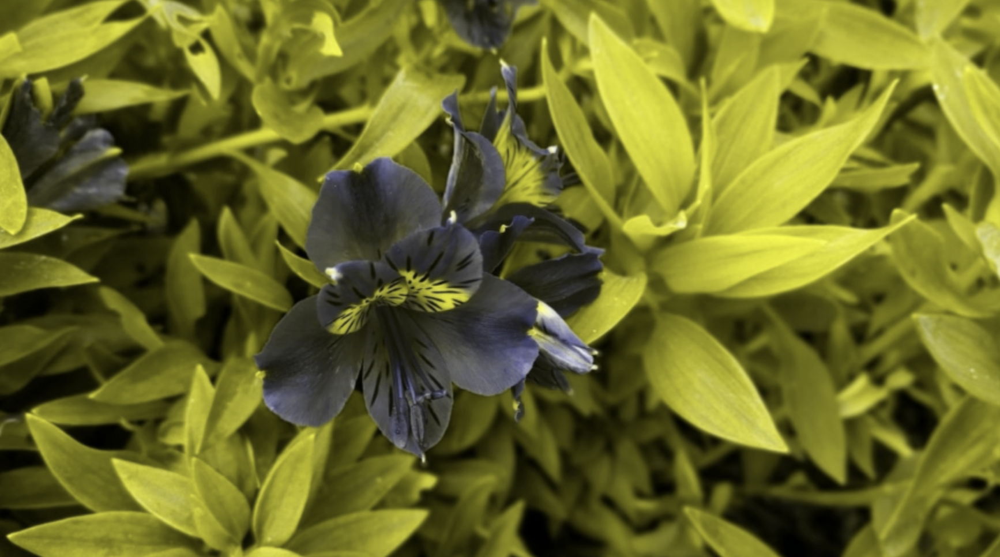
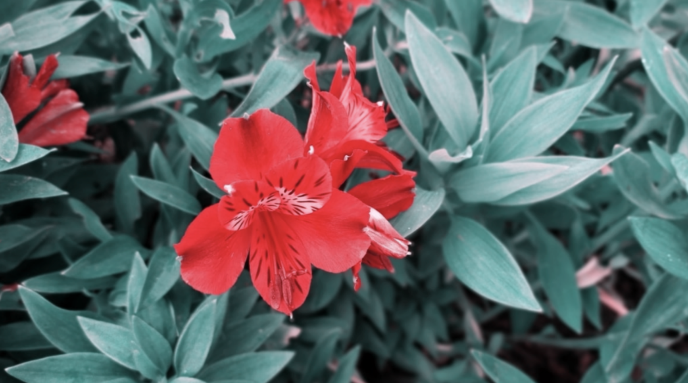

# Color-Blindness-Filter

## Hello everyone,
Our project aims to design, develop, and test a Corrector filter algorithm that can be applied to web page images. 
The primary objective of this algorithm is to enhance color distinction for individuals with color blindness, 
taking into account the specific type of color blindness they experience.

The operation of the corrector filter is succinctly elucidated as follows:

The corrector filter begins by extracting the RGB values from the input image.
Subsequently, the corrector undertakes a comprehensive image processing operation, which is contingent upon the specific type of color blindness selected. This processing is informed by the LMS algorithm, ensuring the accurate and tailored correction of color perception.
Finally, the post-processed image is presented to the user, delivering an improved and more discernible representation of the visual content.

## Example:

This is the original image that the user uploads:

  

...

And when the user uses the Corrector Filter and choose (Green-Blind / Deuteranopia) type, the image will be like this:

 

...

when the user uses the Corrector Filter and choose (Red-Blind / Protanopia) type, the image will be like this:

 

...

And when the user uses the Corrector Filter and choose (Blue-Blind / Tritanopia) type, the image will be like this:

 

