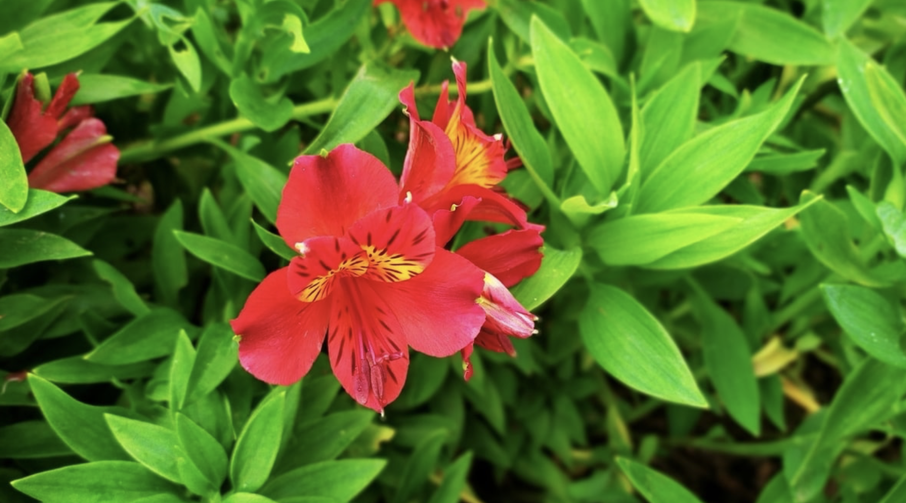
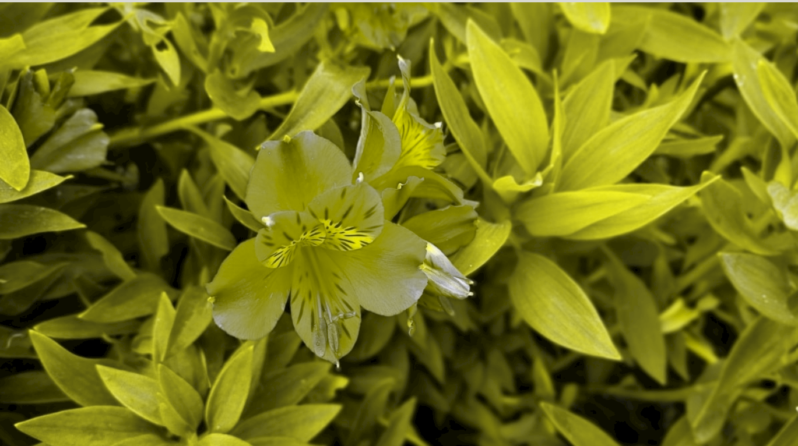
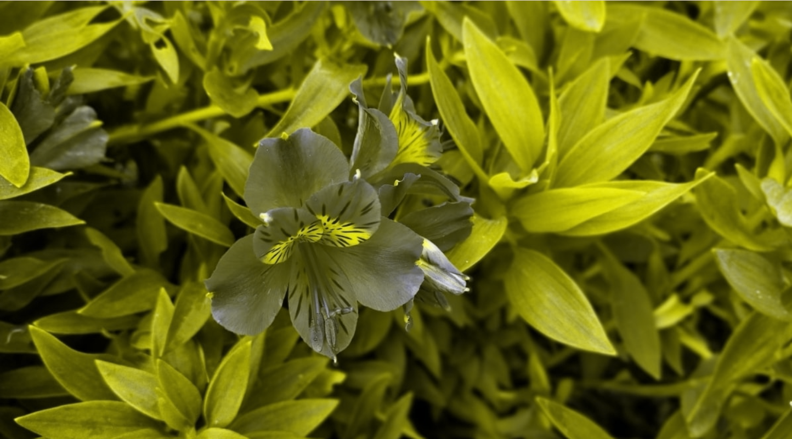

# Color-Blindness-Filter

## Hello everyone,
Our project encompasses two distinct components. The initial facet involves the implementation of a simulation filter designed to provide users with a simulation of the visual experience of individuals with color vision deficiencies, thereby fostering awareness among developers, designers, and other stakeholders regarding the potential impact on this user group.
The second aspect of the project entails the development and deployment of a color correction filter. This filter serves the purpose of enhancing color discrimination for individuals affected by color vision deficiencies, while also considering the specific type of color blindness exhibited by the user. 

The operation of the corrector filter is succinctly elucidated as follows:

The corrector filter begins by extracting the RGB values from the input image.
Subsequently, the corrector undertakes a comprehensive image processing operation, which is contingent upon the specific type of color blindness selected. This processing is informed by the LMS algorithm, ensuring the accurate and tailored correction of color perception.
Finally, the post-processed image is presented to the user, delivering an improved and more discernible representation of the visual content.

## Example:

This is the original image that the user uploads:

  

when the user uses the Simulation Filter, the image will be like this:

 

and when the user uses the Corrector Filter, the image will be like this:

 

